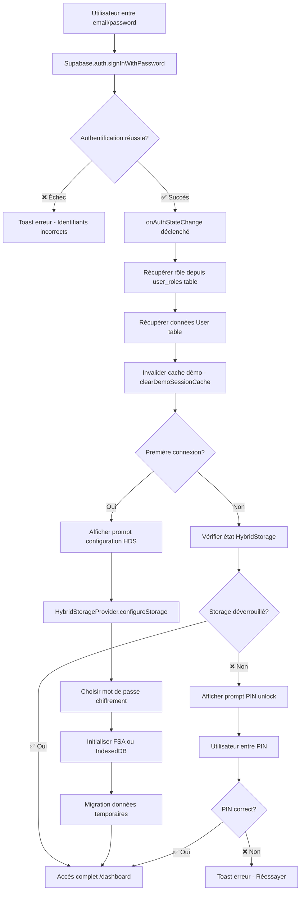
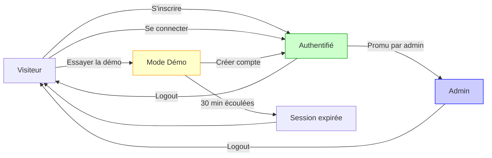

# 🗺️ Architecture des Parcours Utilisateurs - PatientHub

## 📋 Vue d'Ensemble

PatientHub propose **4 modes d'utilisation distincts** avec des niveaux de sécurité et d'accès différenciés :

1. **Mode Visiteur** (non authentifié)
2. **Mode Démo** (session temporaire locale)
3. **Mode Authentifié** (utilisateur réel connecté)
4. **Mode Admin** (administrateur système)

---

## 🚶 1. Mode Visiteur (Non Authentifié)

### Caractéristiques
- ❌ **Pas d'authentification**
- 🌐 **Accès public uniquement**
- 📍 **Aucun stockage de données**

### Pages Accessibles
```
✅ Pages publiques :
  - / (Home)
  - /login
  - /register
  - /demo (Interactive Demo Page)
  - /pricing
  - /contact
  - /confidentialite, /privacy (Privacy Policy)
  - /cgu, /terms (Terms of Service)

❌ Toutes les autres routes redirigent vers /login
```

### Flux de Navigation

```mermaid
graph TD
    A[Visiteur arrive sur /] --> B{Action?}
    B -->|Créer un compte| C[/register]
    B -->|Se connecter| D[/login]
    B -->|Tester l'app| E[/demo - Mode Démo]
    B -->|Découvrir| F[/pricing, /contact]
    
    C --> G[Inscription Supabase Auth]
    G --> H[Email de confirmation]
    H --> D
    
    D --> I[Connexion réussie]
    I --> J[Redirection /dashboard]
    
    E --> K[Session démo locale 30min]
    K --> J
```

### Sécurité
- 🔒 **Aucun accès aux données médicales**
- 🚫 **Routes protégées bloquées** (redirect vers `/login`)
- 📊 **Analytics anonymes uniquement**

---

## 🎭 2. Mode Démo (Session Temporaire Locale)

### Caractéristiques
- ⏱️ **Durée : 30 minutes** (session éphémère)
- 💾 **Stockage : sessionStorage uniquement** (effacé à la fermeture)
- 🎪 **Données fictives** pré-générées localement
- 🚫 **Aucun accès à Supabase** (isolation totale)

### Activation du Mode Démo

#### Option A : Bouton "Essayer la démo" (recommandé)
```typescript
// Composant : DemoLoginButton.tsx
DemoService.createDemoAccount()
  → Crée session locale dans sessionStorage
  → Génère sessionId unique (UUID)
  → Seed données fictives locales
  → Connexion factice (pas de Supabase)
```

#### Option B : Ancienne méthode (legacy, à supprimer)
```typescript
// Email : demo-{sessionId}@patienthub.com
// Crée un compte Supabase temporaire
// ⚠️ Deprecated - À remplacer par Option A
```

### Données Disponibles en Mode Démo

```typescript
// Service : demo-local-storage.ts
{
  patients: [
    { id: 1, firstName: "Jean", lastName: "Dupont", ... },
    { id: 2, firstName: "Marie", lastName: "Martin", ... },
    { id: 3, firstName: "Pierre", lastName: "Bernard", ... }
  ],
  appointments: [
    { date: "dans 2h", reason: "Lombalgie", status: "SCHEDULED" },
    { date: "demain", reason: "Cervicalgie", status: "SCHEDULED" }
  ],
  invoices: [
    { amount: 60, status: "PAID", method: "Carte bancaire" }
  ],
  cabinet: {
    id: 1, // ⚠️ SEUL cabinet autorisé en mode démo
    name: "Cabinet de Démonstration",
    address: "123 Rue de la Démo, 75000 Paris"
  }
}
```

### Limitations & Protections

#### 🛡️ Sécurité Démo
```typescript
// Service : demo-protection.ts

✅ Protection active :
  - Aucun accès Supabase (ensureNotDemo())
  - Seul cabinetId = 1 autorisé
  - Données en sessionStorage (30 min max)
  - Watermarks rouges "MODE DÉMO" sur tous les exports

❌ Interdit en mode démo :
  - Modifier cabinet
  - Accéder à d'autres cabinets
  - Stocker données réelles
  - Exporter sans watermark
```

#### 📤 Exports en Mode Démo

**PDF (Factures & Devis)**
```typescript
// Watermark rouge diagonal
{
  text: "MODE DÉMO - DOCUMENT NON VALABLE",
  color: "red",
  opacity: 0.3,
  rotation: 45°,
  fontSize: 48
}
// Numéro : "DEMO-2024-001"
```

**Excel**
```typescript
// Feuille README visible
{
  A1: "⚠️ MODE DÉMONSTRATION",
  A2: "Ce fichier contient des données fictives",
  A3: "Validité : 30 minutes"
}
// Watermark texte dans chaque cellule
```

### Détection du Mode Démo

```typescript
// Fichier : demo-detection.ts

export async function isDemoSession(): Promise<boolean> {
  // 1️⃣ Priorité : Vérifier Supabase Auth
  const { data: { session } } = await supabase.auth.getSession();
  
  if (session?.user) {
    // Utilisateur authentifié réel
    const isDemoUser = 
      session.user.email === 'demo@patienthub.com' ||
      session.user.email?.startsWith('demo-') ||
      session.user.user_metadata?.is_demo === true;
    
    if (!isDemoUser) {
      // Nettoyer toute session démo résiduelle
      localStorage.removeItem('demo-session');
      return false;
    }
    return true;
  }
  
  // 2️⃣ Fallback : Vérifier session locale
  const localSession = sessionStorage.getItem('demo-session');
  if (localSession) {
    const session = JSON.parse(localSession);
    const isExpired = new Date(session.expiresAt) < new Date();
    return !isExpired;
  }
  
  return false;
}
```

### Timer de Session Démo

```typescript
// Composant : DemoSessionTimer.tsx

Affichage :
  🕐 "Il vous reste 27:34"
  
  ⚠️ < 5 minutes : Badge orange
  🚨 Expiré : "Session expirée - Créer un nouveau compte"
  
Actions :
  - Bouton "Nouvelle session" → Refresh window
  - Auto-cleanup à expiration
```

### Flux de Navigation Mode Démo

```mermaid
graph TD
    A[Visiteur clique "Essayer la démo"] --> B[DemoService.createDemoAccount]
    B --> C[Créer session locale sessionStorage]
    C --> D[sessionId: crypto.randomUUID]
    D --> E[expiresAt: now + 30 minutes]
    E --> F[Seed données fictives locales]
    F --> G[Connexion factice - pas d'appel Supabase]
    G --> H[Redirection /dashboard]
    
    H --> I{Navigation}
    I --> J[Patients fictifs]
    I --> K[RDV fictifs]
    I --> L[Factures fictives]
    
    J --> M{Action export}
    M -->|PDF| N[Watermark rouge + DEMO-XXX]
    M -->|Excel| O[README + warning visible]
    
    P[Timer vérifie expiration] --> Q{30 min écoulées?}
    Q -->|Oui| R[Session expirée - Toast erreur]
    Q -->|Non| P
    
    R --> S[Redirection / - Créer nouveau compte]
```

---

## 🔐 3. Mode Authentifié (Utilisateur Réel)

### Caractéristiques
- ✅ **Authentification Supabase Auth**
- 🏥 **Stockage Hybride HDS** (local + cloud)
- 🔒 **Chiffrement AES-256** des données sensibles
- 🔑 **Protection par PIN** (15 min timeout inactivité)
- 📊 **Audit trail complet** sur tous les exports

### Flux d'Authentification



### Architecture du Stockage Hybride HDS

```
📁 DONNÉES UTILISATEUR RÉEL
├─ 🔒 LOCALES (Sensibles HDS) - Chiffrement AES-256
│  ├─ Backend : File System Access API (priorité)
│  │  ├─ Choix dossier utilisateur
│  │  ├─ Permissions persistantes
│  │  └─ Fichiers .enc chiffrés
│  │
│  └─ Fallback : IndexedDB (si FSA non disponible)
│     ├─ Base de données navigateur
│     ├─ Stockage chiffré
│     └─ Limite ~100 MB
│
├─ ☁️ CLOUD (Métadonnées Supabase)
│  ├─ Cabinet (nom, adresse, contact)
│  ├─ Osteopath (RPPS, SIRET, titre)
│  ├─ User (auth_id, role, email)
│  ├─ Appointment (date, reason, status) - sans notes
│  ├─ Invoice (montant, date, statut) - sans détails médicaux
│  └─ document_exports (audit trail - hash SHA-256)
│
└─ 🗂️ TEMPORAIRE (Configuration)
   ├─ localStorage : hybrid-storage-config, pin-hash
   ├─ sessionStorage : demo-session (mode démo uniquement)
   └─ Cookies : supabase-auth-token
```

### Configuration du Stockage Sécurisé

#### Étape 1 : Premier Login

```typescript
// Contexte : HybridStorageContext.tsx

useEffect(() => {
  if (isAuthenticated && !isDemoMode) {
    // Vérifier si déjà configuré
    const isConfigured = hdsSecureManager.isConfigured();
    
    if (!isConfigured) {
      // 🎯 Première connexion → Afficher wizard
      setShowPinSetup(true);
    } else {
      // 🔓 Déjà configuré → Demander déverrouillage
      setShowUnlock(true);
    }
  }
}, [isAuthenticated, isDemoMode]);
```

#### Étape 2 : Configuration Initiale

```typescript
// Composant : TemporaryStoragePinSetup.tsx

async function handleSetup(pin: string) {
  // 1️⃣ Choisir backend de stockage
  const backend = SecureStorageFactory.detectBestBackend();
  // → 'FSA' si disponible, sinon 'IndexedDB'
  
  // 2️⃣ Créer clé de chiffrement PBKDF2
  const salt = crypto.getRandomValues(new Uint8Array(16));
  const key = await deriveKey(pin, salt, 100000);
  
  // 3️⃣ Initialiser le stockage
  await SecureStorageManager.configure({
    password: pin,
    backend: backend
  });
  
  // 4️⃣ Migrer données temporaires si existantes
  await migrateTemporaryData();
  
  // 5️⃣ Sauvegarder hash PIN pour vérification future
  const pinHash = await generateSHA256(pin);
  localStorage.setItem('pin-hash', pinHash);
  
  toast.success("Stockage sécurisé configuré !");
}
```

#### Étape 3 : Déverrouillage Quotidien

```typescript
// Composant : TemporaryStoragePinUnlock.tsx

async function handleUnlock(pin: string) {
  // 1️⃣ Vérifier hash PIN
  const savedHash = localStorage.getItem('pin-hash');
  const inputHash = await generateSHA256(pin);
  
  if (savedHash !== inputHash) {
    toast.error("PIN incorrect");
    return;
  }
  
  // 2️⃣ Déverrouiller le stockage
  await SecureStorageManager.getStorage().unlock(pin);
  
  // 3️⃣ Démarrer timer inactivité (15 minutes)
  startInactivityTimer();
  
  toast.success("Stockage déverrouillé !");
}
```

### Timeout Inactivité (15 minutes)

```typescript
// Hook : usePinTimeout.ts

export function usePinTimeout() {
  useEffect(() => {
    let timeoutId: NodeJS.Timeout;
    
    const resetTimer = () => {
      clearTimeout(timeoutId);
      timeoutId = setTimeout(() => {
        // 🔒 Verrouiller après 15 min d'inactivité
        SecureStorageManager.getStorage().lock();
        toast.warning("Session verrouillée par inactivité");
      }, 15 * 60 * 1000); // 15 minutes
    };
    
    // Écouter activité utilisateur
    window.addEventListener('mousemove', resetTimer);
    window.addEventListener('keydown', resetTimer);
    window.addEventListener('click', resetTimer);
    
    resetTimer(); // Init
    
    return () => {
      clearTimeout(timeoutId);
      window.removeEventListener('mousemove', resetTimer);
      window.removeEventListener('keydown', resetTimer);
      window.removeEventListener('click', resetTimer);
    };
  }, []);
}
```

### Chiffrement des Données (AES-256-GCM)

```typescript
// Fichier : crypto.ts

// 1️⃣ Dérivation clé (PBKDF2)
async function deriveKey(pin: string, salt: string): Promise<CryptoKey> {
  const encoder = new TextEncoder();
  const keyMaterial = await crypto.subtle.importKey(
    'raw',
    encoder.encode(pin),
    'PBKDF2',
    false,
    ['deriveBits', 'deriveKey']
  );
  
  return crypto.subtle.deriveKey(
    {
      name: 'PBKDF2',
      salt: base64ToBuf(salt),
      iterations: 100000, // Recommandé OWASP
      hash: 'SHA-256'
    },
    keyMaterial,
    { name: 'AES-GCM', length: 256 },
    true,
    ['encrypt', 'decrypt']
  );
}

// 2️⃣ Chiffrement
async function encryptJSON(data: any, pin: string): Promise<EncryptedPayload> {
  const iv = crypto.getRandomValues(new Uint8Array(12));
  const salt = crypto.getRandomValues(new Uint8Array(16));
  
  const key = await deriveKey(pin, bufToBase64(salt));
  const plaintext = JSON.stringify(data);
  
  const ciphertext = await crypto.subtle.encrypt(
    { name: 'AES-GCM', iv },
    key,
    new TextEncoder().encode(plaintext)
  );
  
  return {
    version: 1,
    algorithm: 'AES-256-GCM',
    ciphertext: bufToBase64(ciphertext),
    iv: bufToBase64(iv),
    salt: bufToBase64(salt)
  };
}

// 3️⃣ Déchiffrement
async function decryptJSON(payload: EncryptedPayload, pin: string): Promise<any> {
  const key = await deriveKey(pin, payload.salt);
  
  const plaintext = await crypto.subtle.decrypt(
    { name: 'AES-GCM', iv: base64ToBuf(payload.iv) },
    key,
    base64ToBuf(payload.ciphertext)
  );
  
  return JSON.parse(new TextDecoder().decode(plaintext));
}
```

### Protection des Exports (Mode Authentifié)

#### PDF (Factures & Devis)

```typescript
// Générateur : invoice-pdf-generator.ts

Watermark Professionnel Discret :
{
  text: `PatientHub - ${cabinet.name}`,
  color: "#E5E7EB", // Gris clair
  opacity: 0.1,
  rotation: 45°,
  fontSize: 24
}

Signature Numérique QR Code :
{
  data: {
    invoice_id: "INV-2024-001",
    patient: "Jean Dupont",
    amount: 60,
    date: "2024-01-15",
    hash_sha256: "a1b2c3d4..." // Intégrité document
  },
  position: "bottom-right",
  size: 80x80 px
}

Audit Trail Automatique :
{
  table: "document_exports",
  data: {
    osteopath_id: 123,
    document_type: "invoice_pdf",
    document_id: "INV-2024-001",
    file_hash: "a1b2c3...", // SHA-256 du PDF
    exported_at: "2024-01-15T14:30:00Z",
    patient_id: 456
  }
}
```

#### Excel

```typescript
// Utilitaire : export-utils.ts

Protection Professionnelle :
{
  // Feuille cachée "_Metadata"
  metadata: {
    exported_by: "Dr. Marie Dubois",
    exported_at: "2024-01-15 14:30:00",
    file_hash: "a1b2c3...", // SHA-256 du workbook
    version: "1.0.0",
    disclaimer: "Document professionnel confidentiel"
  },
  
  // Protection lecture seule (facultatif)
  protection: {
    selectLockedCells: true,
    selectUnlockedCells: true,
    formatCells: false,
    insertRows: false
  }
}

Audit Trail :
{
  table: "document_exports",
  data: {
    document_type: "excel_export",
    file_hash: "a1b2c3...",
    exported_at: "2024-01-15T14:30:00Z"
  }
}
```

### Routes Accessibles (Authentifié)

```
✅ Routes protégées :
  - /dashboard
  - /patients (liste, /new, /:id, /:id/edit)
  - /appointments (liste, /new, /:id/edit)
  - /invoices (liste, /new, /:id, /:id/edit)
  - /schedule (planning)
  - /cabinets (gestion multi-cabinet)
  - /team (gestion équipe - Plan Pro)
  - /settings (profil, cabinet, import, storage)
  - /help, /conseils

❌ Routes admin (redirige si non-admin)
```

### Flux de Navigation Mode Authentifié

```mermaid
graph TD
    A[Login réussi] --> B{Première connexion?}
    B -->|Oui| C[Wizard HDS OnboardingWizard]
    B -->|Non| D{Storage déverrouillé?}
    
    C --> E[Choisir PIN 6+ caractères]
    E --> F[Configurer backend FSA/IndexedDB]
    F --> G[Migration données temporaires]
    G --> H[/dashboard]
    
    D -->|❌ Non| I[Prompt PIN unlock]
    D -->|✅ Oui| H
    
    I --> J[Entrer PIN]
    J --> K{PIN correct?}
    K -->|❌ Non| L[Erreur - Réessayer]
    K -->|✅ Oui| M[Démarrer timer inactivité 15min]
    M --> H
    
    H --> N{Action}
    N -->|Créer patient| O[Formulaire /patients/new]
    N -->|Export facture| P[PDF watermark + QR + audit]
    N -->|Inactivité 15min| Q[Lock storage - Re-prompt PIN]
    
    O --> R[Sauvegarder données locales chiffrées]
    R --> S[Sync métadonnées Supabase]
    S --> T[Toast succès]
```

---

## 👑 4. Mode Admin

### Caractéristiques
- 🔐 **Rôle ADMIN** dans table `user_roles`
- 🛠️ **Outils de debug & monitoring**
- 👥 **Gestion utilisateurs** (promotion admin)
- 📊 **Analytics système**

### Détermination du Rôle Admin

```typescript
// Table Supabase : user_roles
{
  user_id: uuid (FK vers auth.users),
  role: enum('admin', 'osteopath'), // Default: 'osteopath'
  created_at: timestamp,
  updated_at: timestamp
}

// Requête dans AuthContext.tsx
const { data: userRolesData } = await supabase
  .from('user_roles')
  .select('role')
  .eq('user_id', session.user.id)
  .maybeSingle();

const userRole = userRolesData?.role === 'admin' ? 'ADMIN' : 'OSTEOPATH';
```

### Routes Admin Exclusives

```
✅ Routes admin uniquement (requireRole="ADMIN") :
  - /admin/dashboard
  - /admin/tech-debug (logs système, état API)
  - /admin/security-audit (scan sécurité)
  - /admin/user-journey (visualisation parcours)

❌ Redirection /dashboard si non-admin tente d'accéder
```

### Fonctionnalités Admin

#### 1. Promotion Utilisateur

```typescript
// Fonction RPC Supabase : promote_user_to_admin
async function promoteToAdmin(targetUserId: string): Promise<boolean> {
  // Vérifier que l'appelant est admin
  if (currentUser.role !== 'ADMIN') {
    throw new Error("Seuls les admins peuvent promouvoir");
  }
  
  // Appeler fonction Supabase sécurisée
  const { error } = await supabase.rpc('promote_user_to_admin', {
    target_user_id: targetUserId
  });
  
  if (error) throw error;
  
  toast.success("Utilisateur promu administrateur");
  return true;
}
```

#### 2. Debug Technique

```
Page : /admin/tech-debug

Sections :
  - 📡 État Supabase (connexion, latence)
  - 🗄️ État HybridStorage (backend, taille, encryption)
  - 👥 Utilisateurs actifs (sessions, dernière activité)
  - 📊 Logs système (erreurs, warnings)
  - 🔍 Requêtes lentes (performance DB)
```

#### 3. Audit de Sécurité

```
Page : /admin/security-audit

Vérifications :
  ✅ RLS (Row Level Security) activé sur toutes les tables
  ✅ Policies restrictives (pas de "true" policy)
  ✅ Chiffrement activé sur données sensibles
  ✅ Tokens JWT valides (expiration < 1h)
  ✅ Exports auditables (document_exports complet)
  ⚠️ Utilisateurs sans activité > 90 jours
  ⚠️ Cabinets sans ostéopathe actif
```

#### 4. Visualisation Parcours Utilisateurs

```
Page : /admin/user-journey

Diagrammes interactifs :
  - 🚶 Parcours visiteur → inscription
  - 🎭 Parcours démo → conversion
  - 🔐 Parcours authentifié → engagement
  - 👑 Parcours admin → administration

Métriques :
  - Taux de conversion démo → inscription : XX%
  - Temps moyen avant premier export : XX min
  - Taux de complétion wizard HDS : XX%
```

### Flux de Navigation Mode Admin

```mermaid
graph TD
    A[Admin login] --> B[onAuthStateChange]
    B --> C[Fetch role = 'admin' from user_roles]
    C --> D[Redirection /admin/dashboard]
    
    D --> E{Action}
    E -->|Gestion users| F[/admin/dashboard - Liste utilisateurs]
    E -->|Debug| G[/admin/tech-debug]
    E -->|Sécurité| H[/admin/security-audit]
    E -->|Analytics| I[/admin/user-journey]
    
    F --> J[Sélectionner utilisateur]
    J --> K[Actions: Promote to Admin, Suspend, Delete]
    
    G --> L[Afficher logs temps réel]
    L --> M[Filtrer par niveau: ERROR, WARN, INFO]
    
    H --> N[Lancer scan sécurité]
    N --> O[Rapport détaillé + recommandations]
    
    I --> P[Visualiser parcours types]
    P --> Q[Identifier points de friction]
```

---

## 📊 Matrice de Comparaison des Modes

| Fonctionnalité | Visiteur | Démo | Authentifié | Admin |
|----------------|----------|------|-------------|-------|
| **Authentification** | ❌ | ⚠️ Locale | ✅ Supabase | ✅ Supabase |
| **Durée session** | N/A | 30 min | Illimitée | Illimitée |
| **Stockage données** | ❌ | sessionStorage | HDS Local + Cloud | HDS Local + Cloud |
| **Chiffrement** | N/A | ❌ | ✅ AES-256 | ✅ AES-256 |
| **Accès Supabase** | ❌ | ❌ | ✅ | ✅ |
| **Création patients** | ❌ | ✅ (fictifs) | ✅ (réels) | ✅ (réels) |
| **Export PDF** | ❌ | ✅ Watermark rouge | ✅ Watermark discret + QR | ✅ Watermark discret + QR |
| **Export Excel** | ❌ | ✅ README warning | ✅ Metadata sheet | ✅ Metadata sheet |
| **Audit trail** | ❌ | ❌ | ✅ | ✅ |
| **Multi-cabinet** | ❌ | ❌ (ID 1 seul) | ✅ | ✅ |
| **Routes admin** | ❌ | ❌ | ❌ | ✅ |
| **Promotion users** | ❌ | ❌ | ❌ | ✅ |
| **Debug tools** | ❌ | ❌ | ❌ | ✅ |

---

## 🔐 Récapitulatif Sécurité par Mode

### 🚶 Visiteur
```
✅ Sécurité maximale : Aucune donnée accessible
❌ Pas de risque : Aucun stockage
📊 Analytics : Anonymes uniquement (page views)
```

### 🎭 Démo
```
✅ Isolation totale : sessionStorage uniquement
✅ Expiration automatique : 30 minutes
✅ Watermarks obligatoires : Tous exports marqués "MODE DÉMO"
✅ Cabinet unique : ID 1 seul, lecture seule
❌ Aucun accès Supabase : Protection totale données réelles
⚠️ Limitation : Données fictives uniquement
```

### 🔐 Authentifié
```
✅ Chiffrement bout-en-bout : AES-256-GCM
✅ Dérivation clé sécurisée : PBKDF2 100k iterations
✅ Protection PIN : Timeout 15 min inactivité
✅ Stockage hybride : Sensible local, métadonnées cloud
✅ Audit complet : SHA-256 hash sur tous exports
✅ Watermarks discrets : Professionnels sans gêne
✅ Signature numérique : QR Code intégrité document
⚠️ Responsabilité utilisateur : Choisir PIN fort
```

### 👑 Admin
```
✅ Toutes protections authentifié : +
✅ RLS strict : Vérifications supplémentaires
✅ Logs auditables : Toutes actions admin tracées
✅ Promotion users : RPC sécurisée Supabase
⚠️ Privilèges élevés : Accès données tous users (lecture seule)
🚨 Responsabilité maximale : Audit régulier recommandé
```

---

## 🗺️ Navigation entre Modes

### Transitions Possibles



### Règles de Transition

1. **Visiteur → Démo**
   - ✅ Instantané, sans inscription
   - 🕐 Durée : 30 minutes
   - 🔄 Répétable à volonté (nouvelle session)

2. **Visiteur → Authentifié**
   - 📝 Inscription requise (email + password)
   - ✉️ Confirmation email obligatoire
   - 🎯 Wizard HDS à la première connexion

3. **Démo → Authentifié**
   - 📝 Créer compte depuis le mode démo
   - ⚠️ Données démo perdues (non transférables)
   - ✅ Recommandé : Inscription rapide pour garder travail

4. **Authentifié → Admin**
   - 🔐 Promotion par un admin existant
   - 🗄️ RPC Supabase sécurisée
   - 📊 Logs de la promotion auditables

5. **Logout (tous modes)**
   - 🧹 Nettoyage session (tokens invalidés)
   - 🔒 Verrouillage HybridStorage (authentifié)
   - ♻️ Retour visiteur (home page)

---

## 🛠️ Points d'Extension Futurs

### Améliorations Prévues

1. **Mode Démo Amélioré**
   - [ ] Migration données démo → compte réel (1-click)
   - [ ] Tutoriels interactifs contextuels
   - [ ] Statistiques d'usage démo (heatmaps)

2. **Mode Authentifié**
   - [ ] Biométrie (Face ID, Touch ID) en complément PIN
   - [ ] Multi-device sync (Sync++  protocol)
   - [ ] Backup automatique cloud (chiffré côté client)
   - [ ] Partage sécurisé dossiers (avec expiration)

3. **Mode Admin**
   - [ ] Dashboard analytics temps réel
   - [ ] Alertes automatiques (sécurité, performance)
   - [ ] Export rapports conformité (RGPD, HDS)
   - [ ] Gestion granulaire permissions (RBAC)

4. **Général**
   - [ ] Mode hors-ligne (Progressive Web App)
   - [ ] Notifications push intelligentes
   - [ ] Intégration calendriers externes (iCal, Google)
   - [ ] API REST publique (avec OAuth2)

---

## 📚 Références Techniques

### Fichiers Clés

```
Architecture Authentification :
  - src/contexts/AuthContext.tsx
  - src/services/api/auth-service.ts
  - src/services/supabase-api/auth-service.ts

Mode Démo :
  - src/contexts/DemoContext.tsx
  - src/services/demo-service.ts
  - src/services/demo-local-storage.ts
  - src/utils/demo-detection.ts
  - src/services/demo-protection.ts

Stockage Hybride HDS :
  - src/contexts/HybridStorageContext.tsx
  - src/services/hds-secure-storage/
  - src/utils/crypto.ts
  - src/hooks/useHybridStorage.ts
  - src/hooks/usePinTimeout.ts

Protection Routes :
  - src/components/ProtectedRoute.tsx
  - src/App.tsx (routing)

Exports Sécurisés :
  - src/utils/export-utils.ts (Excel)
  - src/services/export/invoice-pdf-generator.ts (PDF)
  - src/components/patients/detail/QuoteSendModal.tsx (Devis)
```

### Standards de Sécurité

- **OWASP Top 10** : Conformité totale
- **RGPD** : Droit à l'oubli, portabilité, chiffrement
- **HDS** : Données sensibles chiffrées localement
- **ISO 27001** : Audit trail, gestion accès, logs

---

**Dernière mise à jour** : 2024-01-15  
**Version** : 1.0.0  
**Auteur** : Équipe Technique PatientHub
